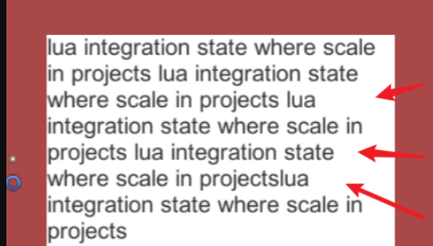

# Unity-hyphen_util
unity英文自动添加连词符“-”

unity自带的text组件当需要换行时会自动把整个单词都移动到下一行，比如下面的情况：

但当我们有一大段文字的时候这种换行规则会导致文字的右边不能完美的与边缘对齐，会空出来一大片，导致美观度降低。

 

所以采用在单词中间进行截断并且添加连词符（-）的方式来避免这种情况的产生。

其主要是利用GetGenerationSettings接口获取字符串的渲染宽度从而自动自动添加连字符，lua 5.1本版需要下载utf8扩展库，其他lua本版自带utf8库
